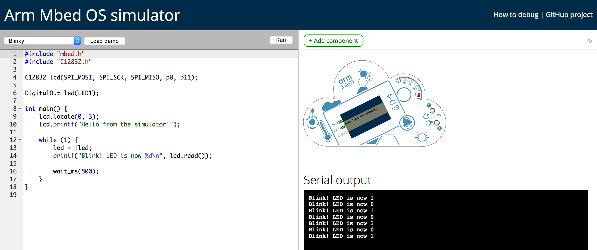
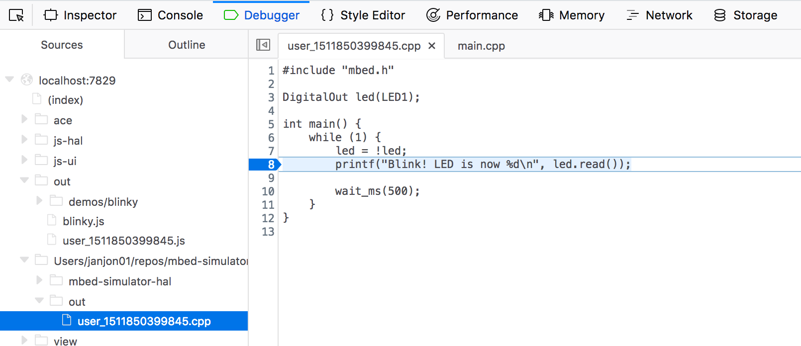

# Experimental simulator for Mbed OS 5 applications

**Demo: http://ec2-52-211-146-247.eu-west-1.compute.amazonaws.com:7829**



Ideas:

* Cross-compile Mbed OS applications with Emscripten.
* Use a custom C++ HAL - based on Mbed OS C++ HAL - which maps into JavaScript HAL. Similar to how Mbed OS C++ HAL maps into Mbed C HAL.
* JavaScript HAL renders UI (board and components), similar to [mbed-js-simulator](https://github.com/janjongboom/mbed-js-simulator).
* Communication with node.js backend for more complex simulations - such as HTTP, BLE (where the computer is a real BLE peripheral) and Mbed Cloud simulation.

This is a very experimental project.

## Architecture

The C++ HAL is in `mbed-simulator-hal`. This HAL uses a fork of Mbed OS 5.8 (living here: [#mbed-os-5.8-simulator](https://github.com/janjongboom/mbed-os/tree/mbed-os-5.8-simulator)), where a new target was added (`TARGET_SIMULATOR`) similar to physical targets. The target handles calls coming in from the Mbed C++ HAL and passes them through to the JS HAL.

The JS HAL lives in `viewer/js-hal`, and dispatches events around between JS UI components and C++ HAL. It implements an event bus to let the UI subscribe to events from C++. For instance, see `js-hal/gpio.js` for GPIO and IRQ handling.

UI lives in `viewer/js-ui`, and handles UI events, and only communicates with JS HAL.

Device features need to be enabled in `targets/TARGET_SIMULATOR/device.h`.

## How to run blinky (or other demo's)

1. Install a recent version of node.js.
1. Install the [Emscripten SDK](http://kripken.github.io/emscripten-site/docs/getting_started/downloads.html) - and make sure `emcc` is in your PATH.
1. Run:

    ```
    # resolve all C++ dependencies
    $ mbed deploy

    # resolve all JS dependencies
    $ npm install

    # build the shared libmbed library (to speed up future compilations)
    $ node build-libmbed.js
    ```

1. Then, start a web server:

    ```
    $ node server/server.js
    ```

1. Open http://localhost:7829 in your browser.
1. Blinky runs!

## Changing mbed-simulator-hal

After changing anything in the simulator HAL, you need to recompile the libmbed library:

1. Run:

    ```
    $ node build-libmbed.js
    ```

## Updating demo's

In the `out` folder a number of pre-built demos are listed. To upgrade them:

```
$ sh build-demos.sh
```

## Debugging

Simulator applications can be debugged using your browser's debugger, because they contain source maps. To debug an application:

**Chrome**


1. Open the Developer Tools via *View > Developer > Developer Tools*.
1. Click *Sources*.
1. Under 'Network', select the name of the application (see the browser hash).
1. Now locate `main.cpp`.
    * On a pre-built demo, go to the `out` folder, select the name of the demo (e.g. `blinky`) and select `main.cpp`.
    * On a user-compiled app, go to the *orange* folder, go to the `out` folder, and select `main.cpp`.
1. Click in the gutter to add a breakpoint.
1. Click the *↻* icon in the simulator to restart the debug session.

**Firefox**



1. Open the Developer Tools via *Tools > Web Developer > Toggle Tools*.
1. Click *Debugger*.
1. Now locate `main.cpp`.
    * On a pre-built demo, go to the `out` folder, select the name of the demo (e.g. `demos/blinky`) and select `main.cpp`.
    * On a user-compiled app, go to the folder that starts with `/home/ubuntu`, go to the `out` folder, and select `user_XXX.cpp`.
1. Click in the gutter to add a breakpoint.
1. Click the *↻* icon in the simulator to restart the debug session.

## CLI

To get a CLI like experience for custom projects (which is currently *very* basic):

```
$ ln -s ~/repos/mbed-simulator/build-project.js /usr/local/bin/mbed-simulator
```

Then from a folder (e.g. mbed-os-example-blinky):

```
$ mbed-simulator .
```

A web browser window will open for you.

## Attribution

* `viewer/img/controller_mbed.svg` - created by [Fritzing](https://github.com/fritzing/fritzing-parts), licensed under Creative Commons Attribution-ShareALike 3.0 Unported.
* Thermometer by https://codepen.io/mirceageorgescu/pen/Ceylz. Licensed under MIT.
* LED icons from https://pixabay.com/en/led-icon-logo-business-light-1715226/, Licensed under CC0 Creative Commons.
